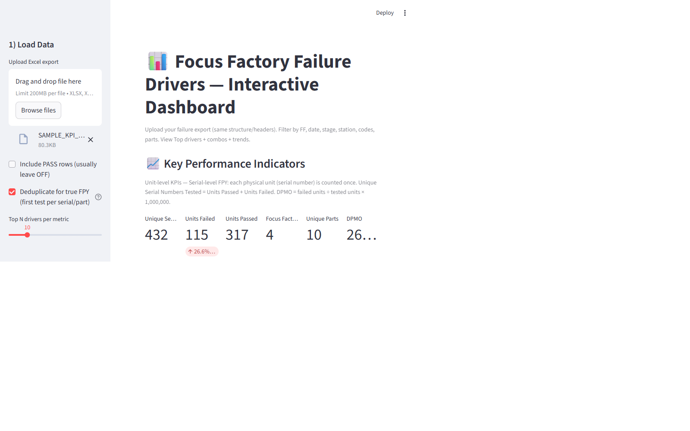
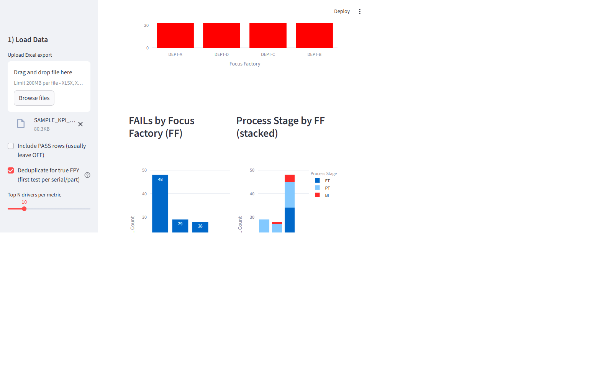
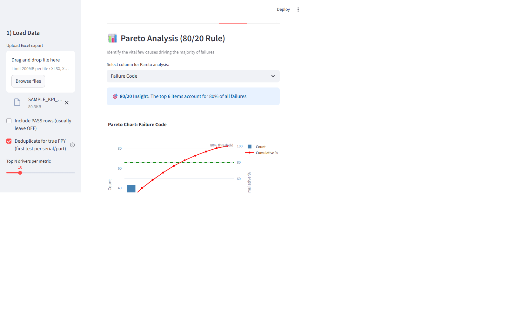
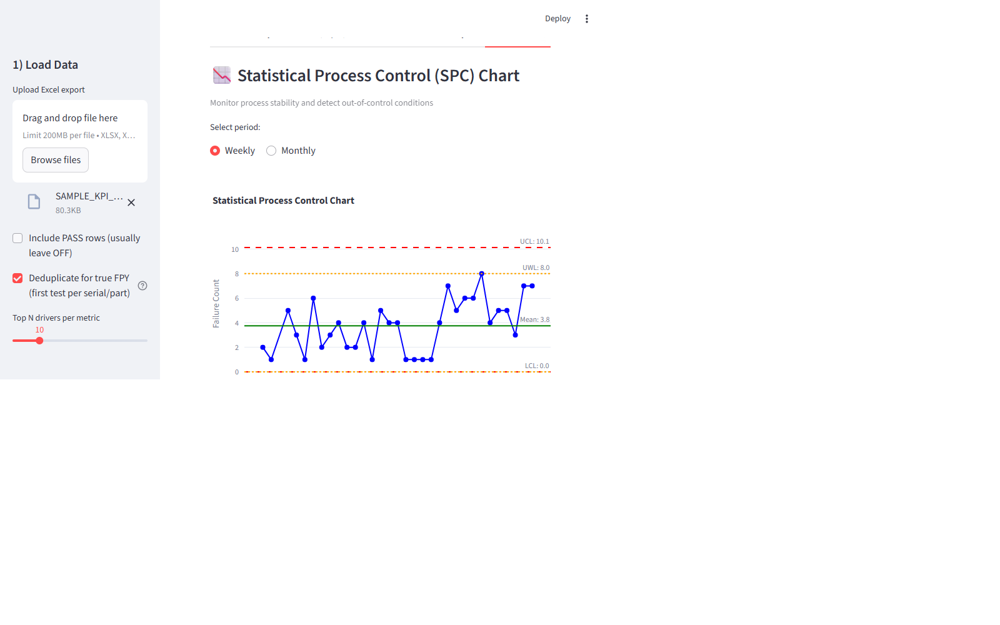
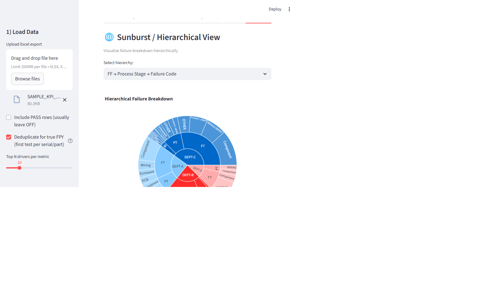
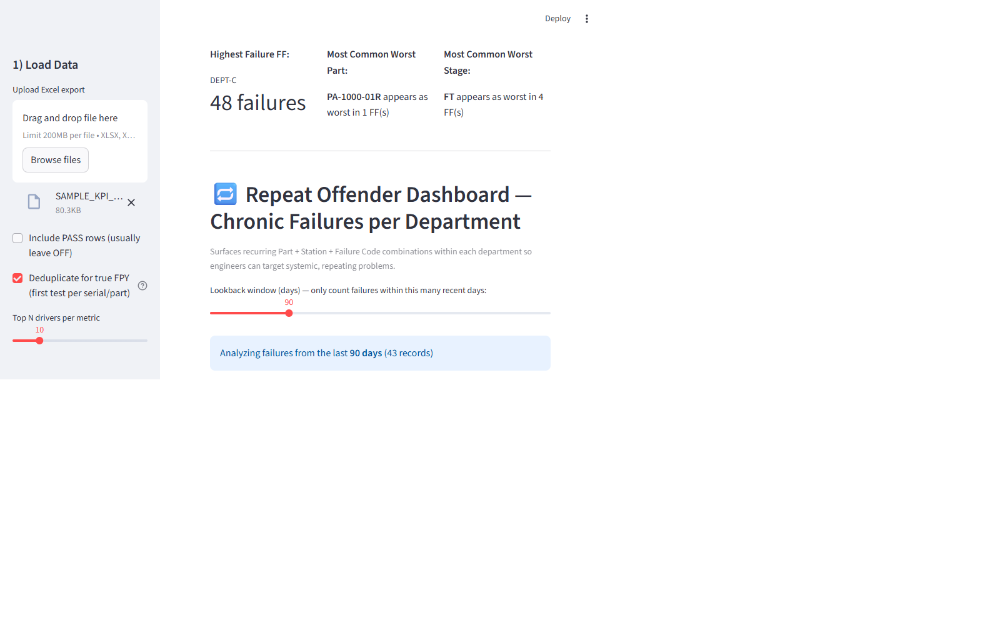
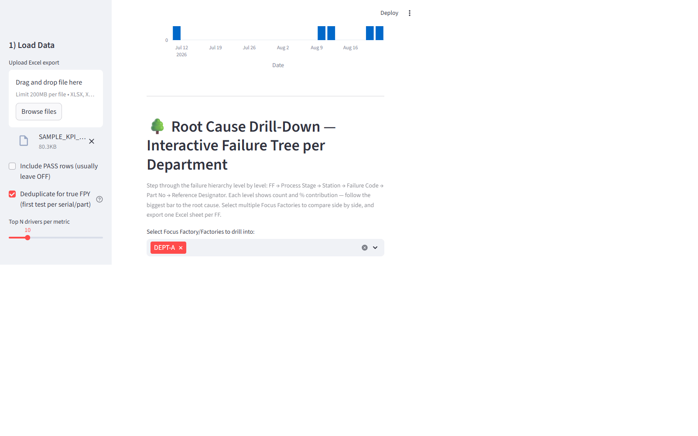
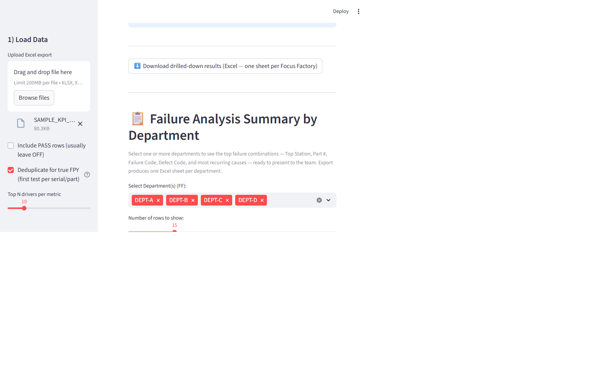

# Manufacturing FPY & Failure-Drivers Analysis Toolkit

> **Sanitized public version.** All product names, part numbers, serial
> numbers, personnel names, and department identifiers are fictional
> placeholders. The bundled Excel file is 100% synthetic data.

A Streamlit dashboard (plus a pure-VBA alternative) for analyzing
**First Pass Yield (FPY)** and failure drivers across **all departments
("Focus Factories")** in a manufacturing test-data export.

The core metric is **True FPY**: a physical unit (serial number) counts as
passed only if it had **zero failures across every process stage** — so
reworked and retested units are never counted as first-pass successes.

## Features

- **True serial-level FPY** with automatic first-test deduplication
  (per serial + process stage), plus FPY by department with
  warning/critical threshold gauges and DPMO
- **Schema-tolerant loading** — fuzzy column-name aliases, automatic
  sheet/header-row detection in messy Excel exports
- **Top failure drivers** per department: process stage, station, failure
  code, defect code, part number, ATE step, failed assembly, operator
- **Combo drivers** (e.g. Stage + Failure + Defect) and Pareto 80/20 analysis
- **SPC control charts** (mean, UCL/LCL, warning limits, out-of-control flags)
- **Trend analysis** with period-over-period changes and rolling averages
- **Repeat-offender detection** — chronic Part + Station + Failure Code combos
- **Interactive root-cause drill-down tree** per department (sunburst/treemap
  + step-by-step breadcrumb filtering)
- **Failure-analysis summary tables** with editable Actions/Status columns
- **One-click Excel exports** — one sheet per department for every view

## Quick Start

```bash
pip install -r requirements.txt

# Generate synthetic multi-department sample data
python generate_sample_data.py        # creates SAMPLE_KPI_DATA.xlsx

# Launch the dashboard
streamlit run fpy_dashboard.py
```

Then upload `SAMPLE_KPI_DATA.xlsx` (or your own export) in the sidebar.

## Input Data Schema

The loader is tolerant of header variations, but these columns unlock the
full feature set:

| Canonical column | Also recognized as |
|---|---|
| `FF` | focus factory, department, dept |
| `Pass or Fail` | result, status, pass/fail |
| `Process Stage` | stage, test stage, test phase |
| `Part No` | part number, pn, p/n, assembly part number |
| `Serial Number` | serial no, serial, sn, s/n |
| `Date Tested` | test date, date, timestamp |
| `Station` | test station, tester, bench |
| `Failure Code` / `Defect Code` | fail code / defect type |
| `Failed ATE Step` | ate step, failed step, test step |
| `Failed Assy` | failed assembly, assembly |
| `Reference Designator` | ref des, refdes |
| `Tested By` | operator, tech |
| `Tech Comments` | comments, notes, failure notes |
| `Rework Instructions` | rework, corrective action |

`generate_sample_data.py` produces a full example workbook for reference.

## Screenshots

All screenshots below were generated from the bundled synthetic sample data.

### KPI Overview — True FPY, gauges, and FPY by department


### Failure drivers — failures by department and stacked stage breakdown


### Pareto analysis (80/20 rule)


### SPC control chart — out-of-control detection


### Sunburst / hierarchical failure breakdown


### Repeat-offender dashboard — chronic Part + Station + Failure Code combos


### Root-cause drill-down tree


### Failure-analysis summary by department (editable Actions/Status)


## How True FPY Is Computed

```
True FPY = serials with ZERO failures across all stages / all tested serials

Deduplication (optional, on by default):
  keep only the FIRST test record per (Serial Number, Process Stage)
  → retests and duplicate passes are removed before counting

DPMO = failed serials ÷ tested serials × 1,000,000
```

## Repository Contents

| File | Purpose |
|---|---|
| `fpy_dashboard.py` | Main multi-department Streamlit dashboard |
| `generate_sample_data.py` | Creates synthetic `SAMPLE_KPI_DATA.xlsx` (4 departments, repeat offenders, retests, edge cases) |
| `KPI_Macro_VBA_Code.bas` | Pure-VBA KPI report generator for Excel-only environments (no Python needed) |
| `requirements.txt` | Python dependencies |

## Notes

- All analysis runs locally in your browser session; no data leaves your machine.
- Handles XLSX/XLSM/XLS uploads with automatic best-sheet and header-row detection.
